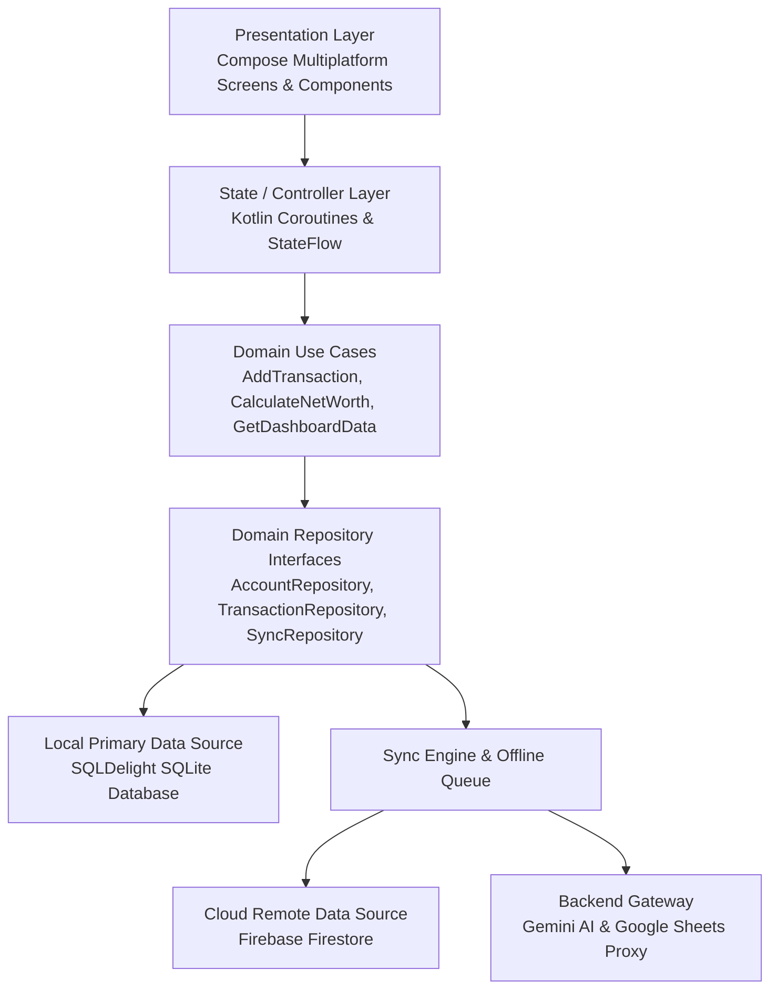

# 🏛 FinPilot 2.0 — Architecture Specification

## 1. Architectural Philosophy
FinPilot 2.0 adopts **Clean Architecture** principles combined with **MVI / MVVM Unidirectional Data Flow (UDF)** across **Kotlin Multiplatform (KMP)** and **Compose Multiplatform**.

By separating business logic, state machines, and data access into platform-agnostic modules, over **85% of code** is shared natively between **Android** and **Web (Wasm / JS)**.

---

## 2. Layer Definitions

### A. Presentation Layer (`:shared-ui`, `:androidApp`, `:webApp`)
- Built exclusively with **Compose Multiplatform**.
- Pure declarative UI listening to immutable `StateFlow` snapshots.
- Responsive layout engine adaptively switching between:
  - **Mobile (< 840dp)**: Bottom Navigation + Floating Quick-Entry Action Button.
  - **Desktop / Tablet (>= 840dp)**: Collapsible FinTech Navigation Sidebar.
- Design tokens enforce a consistent 4px grid, custom `Roboto` type scales, and `LiquidGlass` styling.

### B. Domain Layer (`:domain`)
- Completely independent of UI and third-party frameworks.
- Holds pure Kotlin data models:
  - `Money` (integer minor units for decimal-safe calculation)
  - `Account`, `Transaction`, `Budget`, `SavingsGoal`, `Subscription`, `NetWorth`
- Defines repository contracts (`AccountRepository`, `TransactionRepository`, `AIRepository`, etc.).
- Contains atomic use cases orchestrating business rules:
  - `AddTransactionUseCase`: Ensures balance adjustments and guarantees transfers remain net-worth neutral.
  - `GetDashboardDataUseCase`: Aggregates cash flow, savings rates, and category distribution.
  - `CalculateNetWorthUseCase`: Assets minus liabilities with historical trajectory.

### C. Data Layer (`:data`)
- **Offline Primary Source**: SQLDelight SQLite database (`finpilot_v2.db`).
- Every query returns reactive `Flow<List<T>>` automatically emitting on table mutation.
- Remote Firestore DTOs and mappers.
- Write-first policy: All UI mutations write to local SQLDelight first with status `PENDING_INSERT`/`PENDING_UPDATE`/`PENDING_DELETE`.

### D. Sync Engine Layer (`:sync`)
- Evaluates offline mutations stored in `SyncQueueEntity`.
- Listens to connectivity changes via `NetworkMonitor`.
- Executes bidirectional synchronization with exponential backoff:
  $Delay = \min(1000 \times 2^{attempt}, 60000)\text{ ms}$
- Resolves conflicts using Last-Write-Wins (LWW) with version vector verification.

### E. Secure Backend Gateway (`/backend`)
- Server-side Node.js / TypeScript gateway running on Express / Firebase Functions.
- Shields sensitive credentials (`GEMINI_API_KEY`, `GOOGLE_CLIENT_SECRET`) from client exposure.
- Sanitizes transaction details before submitting to Gemini.
- Facilitates OAuth 2.0 token exchanges with Google Identity and Sheets APIs.
