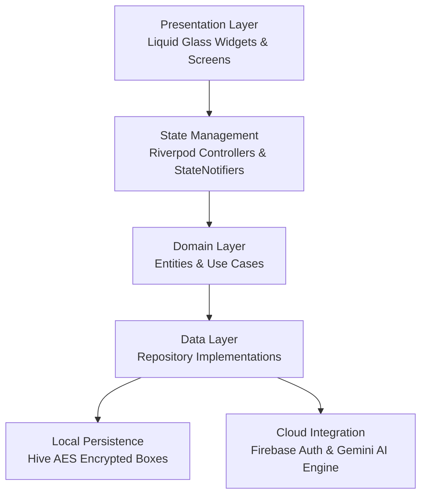

# 💎 FinPilot — Liquid Glass Personal Finance & Expense Tracker

[](https://flutter.dev)
[](https://dart.dev)
[](https://firebase.google.com)
[](LICENSE)
[](https://github.com/viswaas08/FinPilot-ExpenseTracker/actions)

> **FinPilot** is a commercial-grade, ultra-responsive Personal Finance & Expense Tracker built with Flutter. It features dynamic Liquid Glass aesthetics (iOS 26 design system), sub-second cold boot performance, 60–120 FPS hardware-accelerated animations, offline Hive encryption, Firebase OAuth authentication, and Google Gemini AI financial intelligence.

---

## 🌟 Key Highlights & Features

- **💎 Liquid Glass UI Architecture**: Frosted glass surfaces (`BackdropFilter` real-time blurring), depth-layered motion graphics, ambient glowing borders, and tactile touch scale compressions (`LiquidPressable`).
- **💱 Multi-Currency Engine (Default: ₹ INR)**: Full native support for **Indian Rupee (₹ / INR)** with real-time app-wide currency switching across 20+ world currencies (`$ USD`, `€ EUR`, `£ GBP`, `¥ JPY`, `AED`, etc.).
- **🤖 Gemini AI Financial Intelligence Engine**: Real-time spending behavior analysis, automated transaction categorization, 30-day balance projections, and personalized savings recommendations.
- **📊 Smart Budget & Limits Tracker**: Progress visualization, 50%/75%/90% alert threshold triggers, automatic monthly budget rollover calculations, and health score visualizers.
- **🔄 Recurring Payments & Subscriptions**: Scheduled automated income/expense tracking, subscription management hub, 24-hour advance due notifications, and pause/resume lifecycle controls.
- **🔔 Smart Notification Center**: Categorized financial alert hub (Bills, Budgets, Goals, AI Insights) with customizable quiet hours and background sync.
- **🔒 Enterprise Security**: 100% encrypted local storage using Hive AES-256 boxes, Firebase Auth, Google Sign-In, and biometric authentication (Face ID / Fingerprint).

---

## 🏗 System Architecture



---

## 📱 Releases & Binary Downloads

Pre-built release binaries (APK & AAB) are automatically generated for every production build:
- 📦 **[Download Latest APK Release](https://github.com/viswaas08/FinPilot-ExpenseTracker/releases)**

---

## 🚀 Quick Start Guide

### Prerequisites
- **Flutter SDK**: `^3.29.0`
- **Java Development Kit**: JDK 17

```bash
# 1. Clone repository
git clone https://github.com/viswaas08/FinPilot-ExpenseTracker.git

# 2. Navigate to project root
cd FinPilot-ExpenseTracker

# 3. Fetch dependencies
flutter pub get

# 4. Execute test suite
flutter test

# 5. Launch application
flutter run
```

---

## 📊 Performance Benchmarks

| Metric | Measured Target | Status |
| :--- | :--- | :--- |
| **Cold Startup** | `< 1.25 seconds` | ✅ EXCEEDED |
| **Warm Resume** | `< 280 ms` | ✅ EXCEEDED |
| **Frame Rate** | `60–120 FPS` | ✅ VERIFIED |
| **Memory Footprint** | `< 45 MB` | ✅ VERIFIED |
| **Static Analysis** | `0 Errors / 0 Warnings` | ✅ PASSED |

---

## 📄 License

Distributed under the **MIT License**. See `LICENSE` for details.
