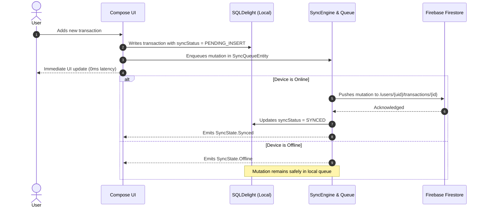

# 🔄 FinPilot 2.0 — Synchronization Architecture

## 1. Overview
FinPilot 2.0 implements a **local-first, bidirectional synchronization engine** that guarantees uninterrupted offline usability on both Android and Web platforms while ensuring eventual consistency across all devices.

---

## 2. Synchronization Flow

---

## 3. Entity Metadata Specification
Every synchronized entity across FinPilot 2.0 contains the following lifecycle attributes:

| Field | Type | Purpose |
| :--- | :--- | :--- |
| `id` | String | Globally unique entity UUID |
| `userId` | String | Owner identifier for cloud security isolation |
| `createdAt` | Long | Epoch timestamp of creation |
| `updatedAt` | Long | Epoch timestamp of latest modification |
| `deletedAt` | Long? | Null if active; set to timestamp upon soft delete |
| `version` | Long | Monotonically incrementing vector version |
| `syncStatus`| Enum | `SYNCED`, `PENDING_INSERT`, `PENDING_UPDATE`, `PENDING_DELETE`, `SYNC_FAILED` |

---

## 4. Conflict Resolution: Last-Write-Wins (LWW)
When concurrent edits happen on both Android and Web:

1. **Version Comparison**: If `remote.version > local.version`, remote takes precedence.
2. **Timestamp Tie-Breaker**: If versions match, `remote.updatedAt >= local.updatedAt` determines the winner.
3. **No Silent Data Loss**: Local records marked `PENDING_DELETE` preserve their audit state until successfully committed to cloud storage.

---

## 5. Resilience & Exponential Backoff
If a network failure or Firestore throttle occurs, the `SyncEngine` retries using exponential backoff:

$$\text{Delay}(attempt) = \min(1000 \times 2^{attempt}, 60000)\text{ ms}$$

- Attempt 0: Immediate
- Attempt 1: 1,000 ms
- Attempt 2: 2,000 ms
- Attempt 3: 4,000 ms
- ... Capped at 60,000 ms (1 minute).

---

## 6. Live UI Indicators
The sync state is exposed via `StateFlow<SyncState>`:
- `✓ Synced` (Green): All local mutations acknowledged by Firestore.
- `↻ Syncing...` (Blue): Active upload or download batch in progress.
- `○ Offline` (Gray): Device has no active internet connection; operating safely locally.
- `⚠ Sync failed` (Red): Network failure or authorization conflict; queued for auto-retry.
